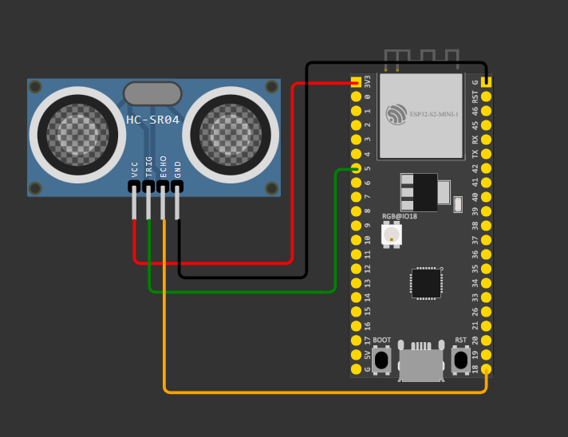

# ⛽ Smart Fuel Monitoring System

A simple and effective ESP32-based IoT system to monitor water/fuel levels, usage trends, and send alerts — all accessible through your mobile phone using the Blynk app.

---

## 🛠️ Features

- Real-time level monitoring (in cm and %)
- Fuel/water usage tracking
- Remaining tank capacity
- Usage trends over time
- Low fuel alerts (push notification)
- Battery-powered with TP4056 charging

---

## ⚙️ Hardware Used

- **ESP32**
- **HC-SR04 Ultrasonic Sensor**
- **TP4056 Charging Module**
- **3.7V Li-ion Battery**

---

## 📲 Blynk Dashboard Preview

| App Screenshot | Circuit |
|----------------|---------|
|  |    🔔 Note:   TP4056 is used in the physical setup  to power the ESP32 via a 3.7V Li-ion battery.|

---

## 📡 Pin Mapping

| Component    | ESP32 Pin |
|--------------|-----------|
| HC-SR04 TRIG | GPIO5     |
| HC-SR04 ECHO | GPIO18    |
| VCC          | 3.3V      |
| GND          | GND       |
| TP4056 OUT+  | VIN       |
| TP4056 OUT−  | GND       |

---

## 📲 Virtual Pin Configuration for Blynk UI

| Virtual Pin  | Feature                               | Widget                     |
|--------------|---------------------------------------|----------------------------|
| V0           | Water Level                           | Gauge                      |
| V1           | Volume of fuel,   Fuel Level Trend| Value Display & SuperChart |
| V2           | Remaining Capacity of Tank            | Value Display              | 
| V3           | Fuel Usage Rate                       | Gauge                      |
| V4           | Distance                              | Value Display              |

---

## 🔔 Alert Logic

Low fuel notification is triggered when level drops below 20%.
 

---

## 🚀 How to Use

1. Upload the code to ESP32
2. Connect your components as shown above
3. Link your Blynk template with correct virtual pins
4. Power on and start monitoring!

---

[Project Report](https://github.com/Rey004/Fuel-Monitoring-System-Prototype/blob/ddc64ab246e2726cc18036a2c40b5d61e6619c3d/Fuel_Water_Monitoring_System.pdf)

---

Made with ❤️ by [Revanshu Pusadkar](https://www.linkedin.com/in/revanshu-pusadkar-454082273/)
